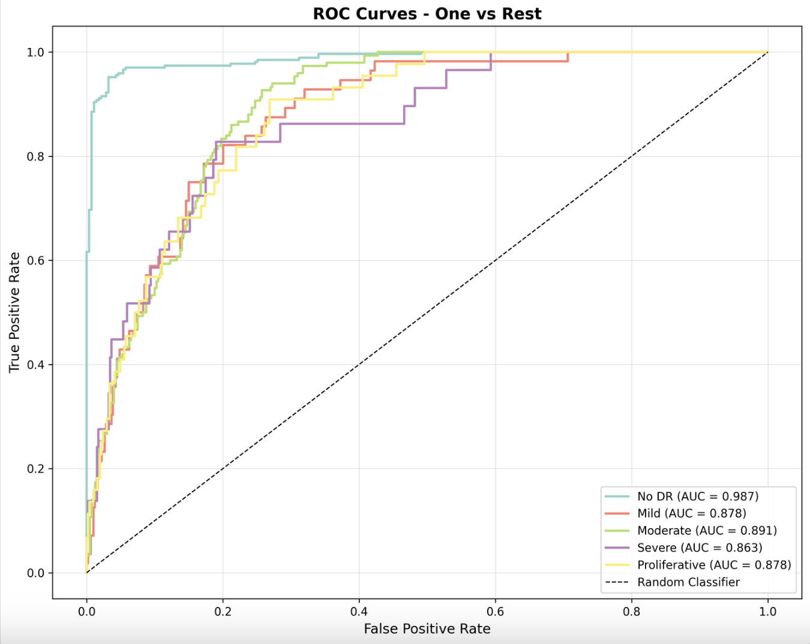
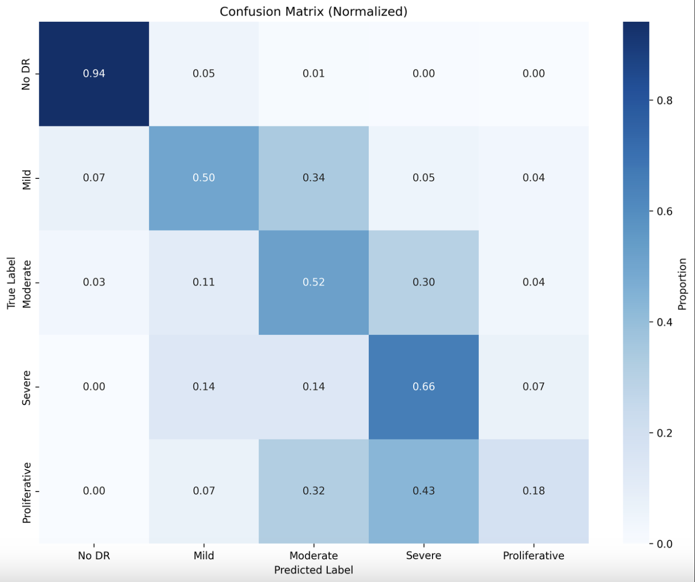
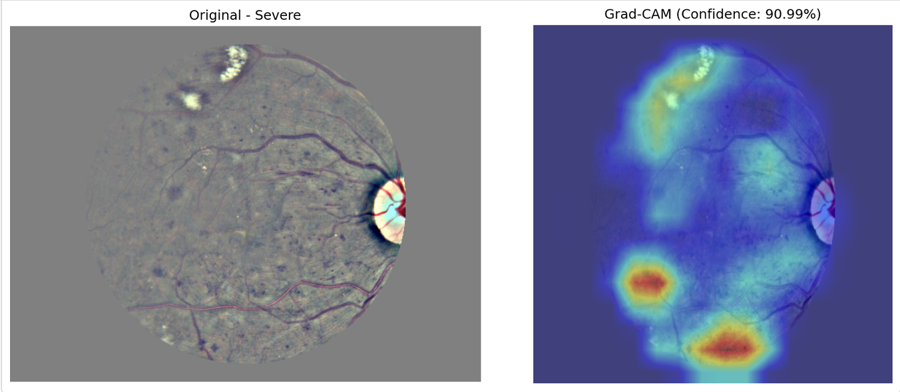

# Diabetic Retinopathy Detection

Automated grading of diabetic retinopathy severity from retinal fundus photographs,
using transfer learning with CNN backbones, retina-normalized preprocessing, and
Grad-CAM interpretability.

Diabetic retinopathy is graded on a five-point ordinal scale — No DR, Mild,
Moderate, Severe, Proliferative — and is a leading cause of preventable blindness.
Screening is bottlenecked on specialist time, which makes automated triage useful
even when it is imperfect.

## Results

Trained on [APTOS 2019](https://www.kaggle.com/c/aptos2019-blindness-detection)
(3,662 labelled fundus images). A stratified 15% split (550 images) was held out
before any cross-validation, so no fold has seen it. Every number below is measured
on that same held-out set.

**3 cross-validation folds completed.** Values are mean ± standard
deviation across folds; figures below are from the final fold (2).

| Metric | Score | Per-fold |
|---|---|---|
| **Quadratic weighted kappa** | **0.796 ± 0.041** | 0.811, 0.749, 0.827 |
| Macro AUC | 0.888 ± 0.011 | 0.886, 0.877, 0.899 |
| Accuracy | 0.642 ± 0.067 | 0.649, 0.573, 0.705 |
| Macro F1 | 0.453 ± 0.084 | 0.484, 0.358, 0.518 |

Quadratic weighted kappa is the primary metric, and is also the official APTOS 2019
metric. It is chance-corrected, which matters because 49% of the dataset is a single
class, and it is distance-weighted, which matters because the grades are ordinal —
calling a Severe case Moderate is a near-miss, calling it No DR a much larger miss. Checkpoint
selection and early stopping are both driven by kappa rather than accuracy.

### Per-class performance

| Grade | n | Sensitivity | Specificity | AUC |
|---|---|---|---|---|
| No DR | 271 | 0.942 ± 0.006 | 0.967 ± 0.005 | 0.988 ± 0.003 |
| Mild | 56 | 0.280 ± 0.207 | 0.959 ± 0.028 | 0.873 ± 0.013 |
| Moderate | 150 | 0.307 ± 0.204 | 0.927 ± 0.026 | 0.857 ± 0.031 |
| Severe | 29 | 0.747 ± 0.105 | 0.785 ± 0.083 | 0.848 ± 0.018 |
| Proliferative | 44 | 0.333 ± 0.160 | 0.949 ± 0.034 | 0.873 ± 0.032 |



*One-vs-rest ROC, fold 2. No DR separates cleanly (AUC 0.987); the four disease
grades sit between 0.863 and 0.891.*

### Error analysis

The gap between a strong kappa (0.796) and a weak accuracy (0.642) is explained by
where the errors land: **70–75% of misclassifications are off by a single grade.**
The model rarely makes a large mistake. It mostly struggles to place adjacent boundaries.



*Row-normalized confusion matrix, fold 2.*

The failure mode is **compression toward grade 3**. Predictions collapse inward from
both directions:

| True grade | Correct | Graded too low | Graded too high |
|---|---|---|---|
| No DR | 94% | — | 6% |
| Mild | 9–50% | 7–12% | 43–79% |
| Moderate | 11–52% | 3–14% | 34–85% |
| Severe | 66–86% | 3–28% | 7–17% |
| **Proliferative** | **18–50%** | **50–82%** | — |

Grade 3 absorbs the difference, being predicted 3–6× more often than it occurs, with
high recall (0.747) but poor precision (0.14–0.22). The single largest cell is true
Moderate predicted as Severe — roughly **40% of all errors** (83, 104, and 45 cases
out of 150). Resolving that one boundary would lift accuracy from 0.642 to
approximately 0.79 with nothing else changed.

Two observations locate the problem. Macro AUC is high and tight across folds
(0.888 ± 0.011) while accuracy is low and variable (0.642 ± 0.067).

### Interpretability



*Left: the preprocessed input — retina rescaled to a constant radius, Ben Graham
local-average subtraction, circular mask. Right: Grad-CAM over the final
convolutional block for a correctly classified Severe case (91% confidence).*

Attention concentrates on discrete lesions in the lower and upper retina rather than
on the image border or the optic disc, which is a basic sanity check that the model
is keying on retinal pathology rather than acquisition artefacts.

## Method

**Preprocessing.** Fundus photographs arrive at widely varying zoom levels, so a
lesion occupies a different pixel count in each image. Each image is cropped to its
lit bounding box, then rescaled so the **retinal disc has a constant radius** (300px),
which makes lesion scale consistent across the dataset. [Ben Graham's local-average
subtraction](https://www.kaggle.com/competitions/diabetic-retinopathy-detection/discussion/15801)
then normalizes the illumination and camera-colour variation that dominates raw
fundus images, making haemorrhages and exudates far more visible. A circular mask
removes corner artefacts. Preprocessing is baked in once rather than re-run per epoch.

**Model.** ImageNet-pretrained ResNet-50 (ResNet-101, EfficientNet-B0/B3 and ViT-B/16
also supported) with a two-layer classification head, at 512×512 input.

**Training.** Adam, cosine annealing, 30 epochs with early stopping. Checkpoint
selection on quadratic weighted kappa. Augmentation is flips, rotation, brightness
and contrast jitter, and blur — hue/saturation jitter is deliberately dropped when
Ben Graham preprocessing is active, since that colour variation has already been
normalized away.

**Validation.** Stratified 3-fold cross-validation on the remaining 85% after the
test split. Folds are trained independently from ImageNet initialization; no fold
warm-starts from another, which would leak that fold's validation images through the
previous fold's training set. All RNGs are seeded and cuDNN is set deterministic.

## Setup

Requires [uv](https://docs.astral.sh/uv/).

```bash
uv sync --group dev
```

torch resolves per-platform: the default PyPI wheel on macOS and Windows, the CUDA
12.4 index on Linux.

## Usage

```bash
# 1. Download APTOS 2019 (needs a Kaggle API token in ~/.kaggle/kaggle.json)
./scripts/download_data.sh

# 2. Build folds and bake in the preprocessing
uv run dr-preprocess \
  --data-dir data/raw/train_images \
  --labels data/raw/train.csv \
  --output-dir data/processed \
  --folds 5 --test-size 0.15 --preprocess-images

# 3. Train (set data.preprocess.enabled: false for baked images)
cp config_example.yaml config.yaml
uv run dr-train --config config.yaml

# 4. Evaluate: metrics, ROC curves, confusion matrices, Grad-CAM samples
uv run dr-evaluate \
  --checkpoint checkpoints/best_model.pth \
  --data-dir data/processed/images \
  --labels data/processed/test_labels.csv \
  --output-dir results/
```

Development:

```bash
uv run pytest
uv run ruff check .
```

## Project structure

```
src/dr_detection/
  core/        datasets and preprocessing, model architectures, training loop
  utils/       metrics (kappa, per-class sensitivity/specificity, AUC), plotting
  cli/         dr-preprocess, dr-train, dr-evaluate
tests/         unit tests for preprocessing, metrics, models, trainer
```

## Next steps

1. **Test the class-weighting hypothesis.** Re-run a fold with loss weighting
   disabled, holding everything else fixed, to confirm it is responsible for the
   grade-3 over-prediction.
2. **Treat the target as ordinal.** A single regression output with thresholds
   optimized on out-of-fold predictions to maximize kappa fits the grade boundaries
   directly, rather than hoping reweighted cross-entropy lands them correctly. Given
   that AUC is high while accuracy is not, this is the largest expected gain.
3. **Ensemble the folds** rather than reporting any single model.
4. **Pretrain on EyePACS 2015** (~35k labelled images, same grading scale) before
   fine-tuning on APTOS.
5. Mixed-precision training, and test-time augmentation at inference.

## License

MIT — see [LICENSE](LICENSE).

*Research project. Not a medical device, and not validated for clinical use.*
